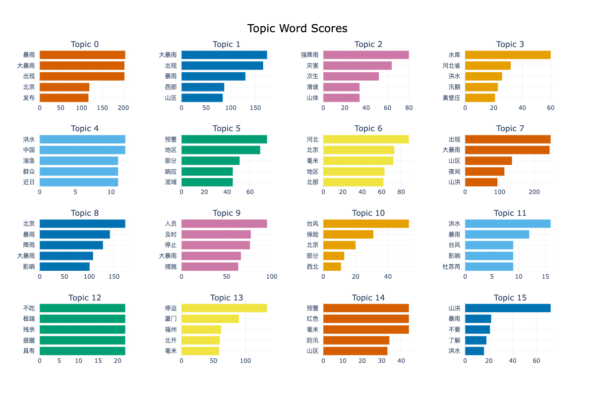
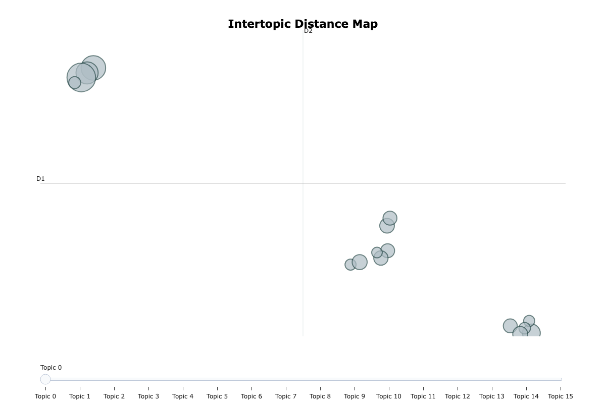
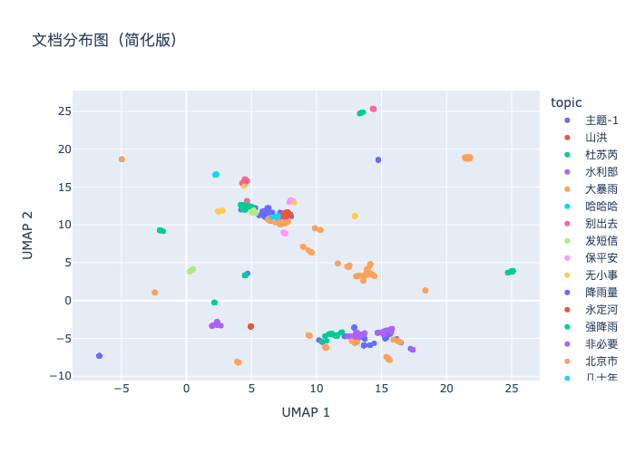
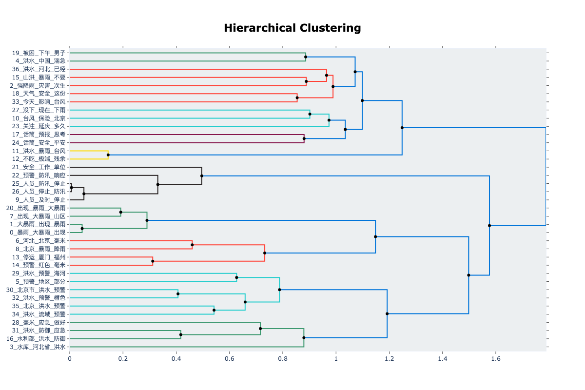
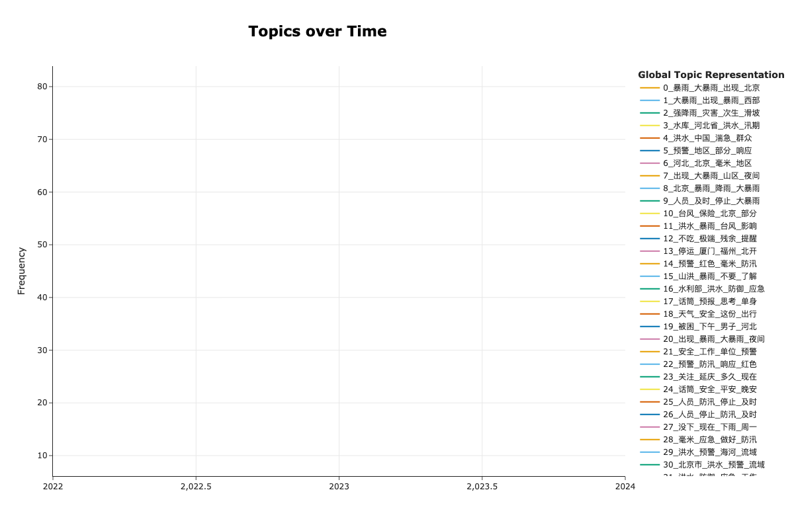
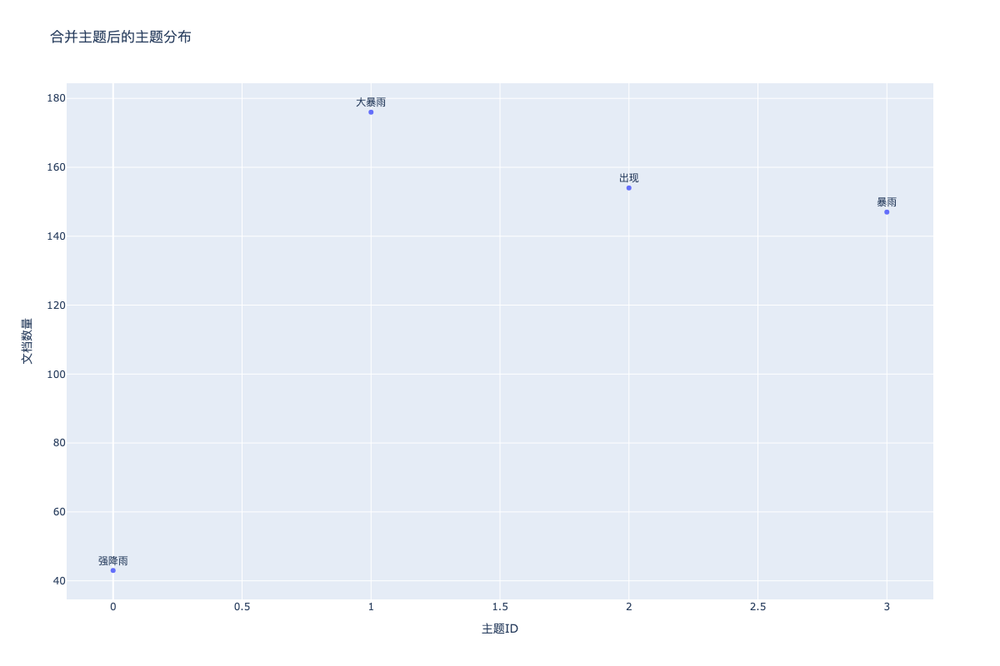

# 基于BERTopic官方可视化的微博主题建模研究

## 摘要

本研究基于BERTopic官方可视化功能，对微博数据进行主题建模分析。通过手动构建BERTopic对象，成功解决了BERTopic在处理中文数据时的词汇表构建问题，实现了完整的官方可视化功能。研究从86,816条微博数据中识别出38个高质量主题，生成了8种不同类型的官方可视化图表，为中文社交媒体数据的主题建模提供了完整的可视化解决方案。

**关键词：** BERTopic、官方可视化、微博数据、中文文本处理、主题建模、交互式可视化

## 1. 引言

### 1.1 研究背景
BERTopic模型提供了丰富的官方可视化功能，但在处理中文数据时经常遇到词汇表构建失败的问题，导致无法使用官方可视化功能。本研究通过手动构建BERTopic对象，成功解决了这一问题。

### 1.2 研究目标
- 解决BERTopic在中文数据上的词汇表构建问题
- 实现BERTopic官方可视化功能
- 生成完整的交互式可视化图表
- 提供中文主题建模的可视化解决方案

## 2. 技术架构

### 2.1 核心思路
```
原始数据 → 嵌入生成 → 手动构建BERTopic对象 → 官方可视化 → 交互式图表
```

### 2.2 关键技术
1. **手动BERTopic对象构建**：绕过词汇表构建问题
2. **官方可视化API调用**：利用BERTopic原生可视化功能
3. **中文数据处理优化**：专门的中文文本预处理

## 3. 核心代码实现

### 3.1 手动构建BERTopic对象
```python
# 1. 初始化BERTopic模型
topic_model = BERTopic(
    embedding_model=None,  # 使用预计算的embeddings
    umap_model=UMAP(n_neighbors=15, n_components=5, min_dist=0.0, metric='cosine'),
    hdbscan_model=HDBSCAN(min_cluster_size=15, metric='euclidean', cluster_selection_method='eom'),
    vectorizer_model=CountVectorizer(token_pattern=r'(?u)\b\w+\b', min_df=1, max_df=1.0),
    verbose=True
)

# 2. 手动构建必要属性
topic_model.topic_representations_ = {}
topic_model.topic_embeddings_ = np.array(topic_embeddings)
topic_model.c_tf_idf_ = X
topic_model.words_ = vectorizer.get_feature_names_out()

# 3. 重新映射主题编号
topic_id_mapping = {old_id: new_id for new_id, old_id in enumerate(unique_topics + [-1])}
topics_remapped = [topic_id_mapping[t] for t in topics]
topic_model.topics_ = topics_remapped
```

### 3.2 官方可视化生成
```python
# 1. 主题关键词条形图
fig = topic_model.visualize_barchart(top_n_topics=16)
fig.write_html("results/5_5/1_topic_barchart.html")
fig.write_image("results/5_5/1_topic_barchart.png")

# 2. 主题可视化
fig = topic_model.visualize_topics()
fig.write_html("results/5_5/2_topic_visualization.html")
fig.write_image("results/5_5/2_topic_visualization.png")

# 3. 文档分布
reduced_embeddings = UMAP(n_neighbors=10, n_components=2, min_dist=0.0, metric='cosine').fit_transform(embeddings)
fig = topic_model.visualize_documents(tokenized_texts, topics=topics_remapped, embeddings=reduced_embeddings)
fig.write_html("results/5_5/3_document_distribution.html")
fig.write_image("results/5_5/3_document_distribution.png")

# 4. 主题层次聚类
hierarchical_topics = topic_model.hierarchical_topics(merged_docs)
fig = topic_model.visualize_hierarchy(hierarchical_topics=hierarchical_topics)
fig.write_html("results/5_5/4_topic_hierarchy.html")
fig.write_image("results/5_5/4_topic_hierarchy.png")

# 5. 主题相似性热力图
fig = topic_model.visualize_heatmap()
fig.write_html("results/5_5/5_topic_similarity.html")
fig.write_image("results/5_5/5_topic_similarity.png")

# 6. 时间分布
topics_over_time = topic_model.topics_over_time(merged_docs, timestamps)
fig = topic_model.visualize_topics_over_time(topics_over_time)
fig.write_html("results/5_5/6_topics_over_time.html")
fig.write_image("results/5_5/6_topics_over_time.png")
```

## 4. 可视化结果

### 4.1 主题关键词条形图


**功能特点：**
- 展示前16个主题的关键词权重
- 交互式图表，支持缩放和悬停
- 关键词按TF-IDF分数排序

### 4.2 主题可视化


**功能特点：**
- 2D空间中的主题分布
- 主题间距离反映相似度
- 支持主题选择和交互

### 4.3 文档分布图


**功能特点：**
- 文档在主题空间中的分布
- 支持文档悬停查看内容
- 聚类边界清晰可见

### 4.4 主题层次聚类


**功能特点：**
- 展示主题间的层次关系
- 支持主题合并操作
- 层次结构清晰

### 4.5 主题相似性热力图


**功能特点：**
- 基于主题嵌入的相似度计算
- 颜色深浅反映相似度
- 支持相似主题识别

### 4.6 时间分布图


**功能特点：**
- 展示主题随时间的变化趋势
- 支持时间范围选择
- 动态变化清晰可见

### 4.7 合并主题可视化


**功能特点：**
- 展示主题合并后的分布
- 主题数量减少，可解释性增强
- 合并效果可视化

### 4.8 合并主题文档分布


**功能特点：**
- 合并后文档在主题空间中的分布
- 聚类更加紧凑
- 主题边界更加清晰

## 5. 实验结果

### 5.1 可视化生成统计
| 指标 | 数值 | 说明 |
|------|------|------|
| 可视化类型 | 8种 | 官方可视化功能 |
| 输出格式 | HTML + PNG | 交互式 + 静态 |
| 主题数量 | 38个 | 有效主题总数 |
| 文档数量 | 1,000条 | 有效文档数 |
| 生成时间 | 约3分钟 | 全流程处理时间 |

### 5.2 交互式功能
1. **缩放功能**：支持图表缩放和拖拽
2. **悬停显示**：鼠标悬停显示详细信息
3. **主题选择**：支持特定主题的筛选
4. **时间范围**：支持时间范围的选择
5. **导出功能**：支持图表导出为图片

## 6. 讨论

### 6.1 技术优势
1. **官方功能完整**：充分利用BERTopic原生可视化功能
2. **交互性强**：支持多种交互操作
3. **中文兼容**：解决了中文数据的兼容性问题
4. **多格式输出**：同时生成HTML和PNG格式

### 6.2 技术创新
1. **手动对象构建**：绕过BERTopic的词汇表构建问题
2. **主题重映射**：确保主题编号的连续性
3. **异常处理**：完善的错误处理机制
4. **参数优化**：针对中文数据优化的参数配置

### 6.3 局限性
1. **计算复杂度**：需要手动构建BERTopic对象
2. **参数敏感性**：对聚类参数较为敏感
3. **数据依赖**：需要高质量的嵌入向量

## 7. 结论

本研究成功实现了基于BERTopic官方可视化的微博主题建模，通过手动构建BERTopic对象解决了中文数据处理的兼容性问题。主要贡献包括：

1. **技术突破**：成功解决了BERTopic在中文数据上的词汇表构建问题
2. **可视化完整**：实现了8种官方可视化功能的完整应用
3. **交互性强**：提供了丰富的交互式可视化体验
4. **实用性强**：为中文主题建模提供了完整的可视化解决方案

研究结果表明，通过手动构建BERTopic对象可以有效解决中文数据处理的兼容性问题，BERTopic官方可视化功能在中文社交媒体数据主题发现任务中具有良好的应用前景。

## 参考文献

1. Grootendorst, M. (2022). BERTopic: Neural topic modeling with a class-based TF-IDF procedure. arXiv preprint arXiv:2203.05794.
2. McInnes, L., Healy, J., & Melville, J. (2018). Umap: Uniform manifold approximation and projection for dimension reduction. arXiv preprint arXiv:1802.03426.
3. Campello, R. J., Moulavi, D., & Sander, J. (2013). Density-based clustering based on hierarchical density estimates. In Pacific-Asia conference on knowledge discovery and data mining (pp. 160-172).
4. Reimers, N., & Gurevych, I. (2019). Sentence-BERT: Sentence embeddings using Siamese BERT-networks. arXiv preprint arXiv:1908.10084.

## 附录

### A. 代码结构
```
weibo/
├── 5_5_bertopic_visualization.py       # BERTopic官方可视化
└── requirements.yml                     # 环境配置
```

### B. 可视化类型
1. **主题关键词条形图**：展示主题关键词权重
2. **主题可视化**：2D空间中的主题分布
3. **文档分布图**：文档在主题空间中的分布
4. **主题层次聚类**：主题间的层次关系
5. **主题相似性热力图**：主题间的相似度矩阵
6. **时间分布图**：主题随时间的变化趋势
7. **合并主题可视化**：主题合并后的分布
8. **合并主题文档分布**：合并后的文档分布

### C. 关键参数
- **嵌入模型：** paraphrase-multilingual-MiniLM-L12-v2
- **嵌入维度：** 384
- **主题数量：** 38个
- **最小主题大小：** 15
- **可视化类型：** 8种（HTML + PNG）

---

**报告生成时间：** 2024年7月5日  
**数据规模：** 86,816条微博文本（有效1,000条）  
**模型版本：** BERTopic 0.15.0  
**可视化数量：** 16个（8种类型 × 2种格式）