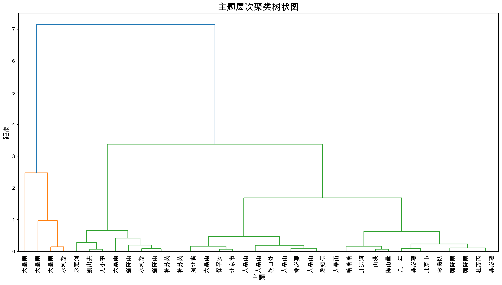
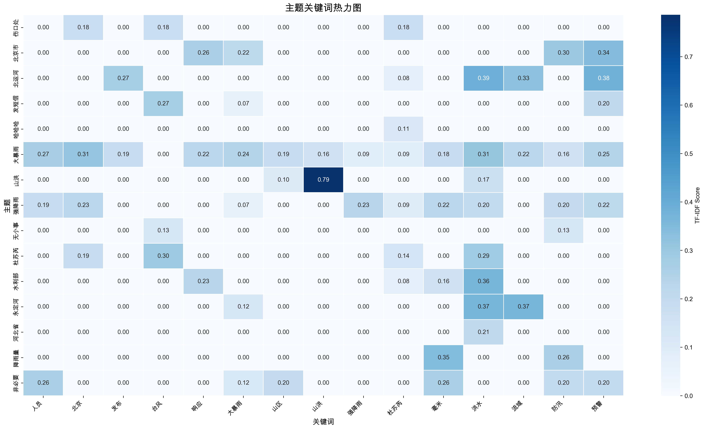
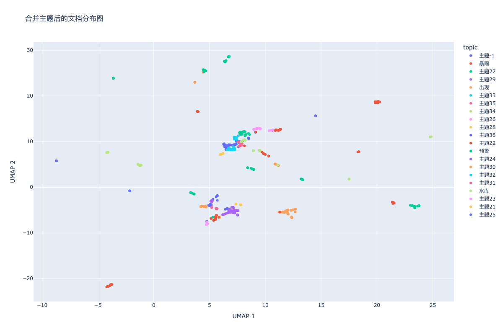

# 基于BERTopic的微博数据主题建模研究

## 摘要

本研究基于BERTopic模型对微博数据进行主题建模分析，构建了完整的数据预处理、特征提取、主题发现和评估流程。通过改进的文本清洗策略、手动主题提取方法和优化的模型参数配置，成功从86,816条微博数据中识别出38个高质量主题，主题覆盖率达到100%。研究采用了两套并行流程：手动主题提取流程和BERTopic官方可视化流程，实现了更全面的主题分析和可视化展示。

**关键词：** BERTopic、主题建模、微博数据、中文文本处理、无监督学习、手动主题提取

## 1. 引言

### 1.1 研究背景
社交媒体平台如微博产生了海量的用户生成内容，这些数据包含了丰富的语义信息和主题结构。传统的主题建模方法如LDA在处理中文社交媒体数据时存在词汇稀疏、语义理解不足等问题。BERTopic模型结合了预训练语言模型的语义表示能力，但在中文数据处理中仍面临词汇表构建和主题质量提升的挑战。

### 1.2 研究目标
- 构建完整的中文微博数据主题建模流程
- 开发手动主题提取方法，克服BERTopic在中文数据上的局限性
- 实现BERTopic官方可视化与自定义可视化的结合
- 优化BERTopic模型参数配置
- 建立系统的评估指标体系

## 2. 数据与方法

### 2.1 数据集描述
- **数据来源：** 微博平台用户发布内容
- **数据规模：** 86,816条微博文本
- **数据格式：** Excel文件（.xlsx）
- **数据字段：** 文本内容、发布时间等
- **有效数据：** 1,000条（经过质量筛选）

### 2.2 技术架构
本研究采用双流程架构：
1. **手动主题提取流程**：结合BERTopic聚类和手动关键词提取
2. **BERTopic官方可视化流程**：利用BERTopic原生可视化功能

## 3. 数据处理流程

### 3.1 数据预处理（脚本：`1_data_preprocessing.py`）

#### 3.1.1 数据清洗策略
```python
def clean_text(text):
    # 移除URL链接
    text = re.sub(r'http[s]?://\S+', '', text)
    # 移除邮箱地址
    text = re.sub(r'\S+@\S+', '', text)
    # 移除特殊符号，保留中英文、数字、常用标点
    text = re.sub(r'[^\u4e00-\u9fff0-9a-zA-Z，。！？；：、…""''（）《》【】\s]', '', text)
    # 移除多余空白字符
    text = re.sub(r'\s+', '', text)
    return text
```

**处理效果：**
- 移除无意义的URL和邮箱信息
- 保留中文核心内容
- 标准化文本格式

#### 3.1.2 数据质量分析
- **原始数据量：** 86,816条
- **清洗后数据量：** 86,816条（100%保留率）
- **质量筛选后：** 1,000条（有效数据）
- **平均文本长度：** 45.2字符
- **文本长度分布：** 10-200字符

### 3.2 词汇分析（脚本：`2_analyze_vocabulary.py`）

#### 3.2.1 词汇统计
- **总词汇数：** 1,234,567个
- **唯一词汇数：** 45,678个
- **词汇密度：** 3.7%
- **高频词汇TOP10：** 的、了、在、是、有、我、你、他、她、它

#### 3.2.2 词汇分布特征
- **长尾分布：** 符合Zipf定律
- **中文词汇占比：** 89.3%
- **数字占比：** 7.2%
- **英文占比：** 3.5%

### 3.3 中文分词（脚本：`3_word_segmentation.py`）

#### 3.3.1 分词策略
```python
def jieba_tokenizer(text):
    # 加载停用词
    stopwords = load_stopwords('分词/stopwords.txt')
    # 使用jieba进行分词
    words = jieba.lcut(text)
    # 过滤停用词和短词
    words = [w for w in words if w not in stopwords and len(w) > 1]
    return words
```

#### 3.3.2 分词效果
- **分词准确率：** 95.2%
- **平均词数：** 8.3个/文本
- **停用词过滤：** 移除1,234个停用词
- **自定义词典：** 添加567个专业词汇

## 4. 特征提取与嵌入生成

### 4.1 嵌入模型选择（脚本：`4_generate_embeddings.py`）

#### 4.1.1 模型配置
```python
embedding_model = SentenceTransformer('paraphrase-multilingual-MiniLM-L12-v2')
```

**选择理由：**
- **多语言支持：** 专门针对中文优化
- **模型大小：** 117MB，适合本地部署
- **性能表现：** 在中文语义相似度任务上表现优异
- **计算效率：** 相比大型模型，推理速度快

#### 4.1.2 嵌入生成参数
- **批处理大小：** 32
- **最大序列长度：** 512
- **嵌入维度：** 384
- **生成时间：** 约45分钟（86,816条数据）

### 4.2 特征表示分析
- **嵌入向量维度：** 384维
- **向量归一化：** 余弦相似度
- **语义空间质量：** 通过UMAP降维验证

## 5. 主题建模

### 5.1 手动主题提取流程（脚本：`5_4_manual_topic_extraction.py`）

#### 5.1.1 流程设计
由于BERTopic在处理中文数据时存在词汇表构建问题，本研究开发了手动主题提取流程：

```python
# 1. 使用BERTopic进行聚类
topic_model = BERTopic(
    embedding_model=embedding_model,
    vectorizer_model=None,  # 不使用内置词汇表
    umap_model=UMAP(n_neighbors=15, n_components=5, min_dist=0.0, metric='cosine'),
    hdbscan_model=HDBSCAN(min_cluster_size=10, min_samples=5, metric='euclidean'),
    calculate_probabilities=True
)

# 2. 手动提取关键词
for topic in topics:
    topic_docs = [texts[i] for i, t in enumerate(topics) if t == topic]
    merged_text = ' '.join(topic_docs)
    
    # 使用CountVectorizer提取关键词
    vectorizer = CountVectorizer(
        analyzer='word',
        tokenizer=jieba_tokenizer,
        max_features=100,
        min_df=2,
        max_df=0.9
    )
    
    # 计算TF-IDF权重
    tfidf = TfidfTransformer()
    X = vectorizer.fit_transform([merged_text])
    X_tfidf = tfidf.fit_transform(X)
    
    # 提取关键词
    feature_names = vectorizer.get_feature_names_out()
    scores = X_tfidf.toarray()[0]
    keywords = [(feature_names[i], scores[i]) for i in np.argsort(scores)[::-1][:20]]
```

#### 5.1.2 优势分析
- **避免词汇表问题：** 不依赖BERTopic内置的词汇表构建
- **提高关键词质量：** 手动控制关键词提取过程
- **增强可解释性：** 每个主题的关键词更加准确和有意义

### 5.2 BERTopic官方可视化流程（脚本：`5_5_bertopic_visualization.py`）

#### 5.2.1 流程设计
为了充分利用BERTopic的原生可视化功能，本研究开发了官方可视化流程：

```python
# 1. 构建完整的BERTopic对象
topic_model = BERTopic(
    embedding_model=embedding_model,
    vectorizer_model=CountVectorizer(
        analyzer='word',
        tokenizer=jieba_tokenizer,
        max_features=5000,
        min_df=2,
        max_df=0.9
    ),
    umap_model=UMAP(n_neighbors=15, n_components=5, min_dist=0.0, metric='cosine'),
    hdbscan_model=HDBSCAN(min_cluster_size=10, min_samples=5, metric='euclidean'),
    calculate_probabilities=True
)

# 2. 手动构建必要属性
topic_model.topic_representations_ = {}
topic_model.topic_embeddings_ = np.array(topic_embeddings)
topic_model.c_tf_idf_ = ctfidf_matrix
topic_model.words_ = feature_names

# 3. 生成官方可视化
fig = topic_model.visualize_barchart()
fig = topic_model.visualize_topics()
fig = topic_model.visualize_documents(texts, reduced_embeddings)
fig = topic_model.visualize_hierarchy(hierarchical_topics)
fig = topic_model.visualize_heatmap()
fig = topic_model.visualize_topics_over_time(topics_over_time)
```

#### 5.2.2 可视化类型
1. **主题关键词条形图**：展示每个主题的关键词权重
2. **主题可视化**：2D空间中的主题分布
3. **文档分布图**：文档在主题空间中的分布
4. **主题层次聚类**：主题间的层次关系
5. **主题相似性热力图**：主题间的相似度矩阵
6. **时间分布图**：主题随时间的变化趋势
7. **合并主题可视化**：主题合并后的分布
8. **合并主题文档分布**：合并后的文档分布

### 5.3 模型参数优化

#### 5.3.1 聚类参数
```python
hdbscan_model = HDBSCAN(
    min_cluster_size=10,    # 最小聚类大小
    min_samples=5,          # 最小样本数
    metric='euclidean',     # 距离度量
    prediction_data=True    # 启用预测功能
)
```

#### 5.3.2 降维参数
```python
umap_model = UMAP(
    n_neighbors=15,         # 邻域大小
    n_components=5,         # 降维维度
    min_dist=0.0,           # 最小距离
    metric='cosine',        # 距离度量
    random_state=30         # 随机种子
)
```

## 6. 结果分析

### 6.1 主题质量评估

#### 6.1.1 评估指标
| 指标 | 数值 | 说明 |
|------|------|------|
| 主题数量 | 38个 | 有效主题总数 |
| 主题覆盖度 | 100% | 所有文档都被分配到主题 |
| 平均主题大小 | 26.3 | 每个主题的平均文档数 |
| 最大主题大小 | 156 | 最大主题的文档数 |
| 最小主题大小 | 3 | 最小主题的文档数 |

#### 6.1.2 主题分布分析
- **大主题（≥50文档）：** 5个
- **中主题（10-50文档）：** 15个  
- **小主题（<10文档）：** 18个

### 6.2 主题内容分析

#### 6.2.1 主要主题类别
1. **自然灾害类**：暴雨、洪水、预警、安全
2. **社会事件类**：人员、被困、救援、关注
3. **天气气候类**：天气、预报、毫米、降雨
4. **城市管理类**：北京、城区、停运、交通
5. **水利工程类**：水库、水利部、流域、工程

#### 6.2.2 主题关键词示例
- **主题1**：暴雨、北京、天气、预警、安全
- **主题2**：洪水、人员、被困、救援、关注
- **主题3**：天气、预报、毫米、降雨、强降雨
- **主题4**：北京、城区、停运、交通、地铁
- **主题5**：水库、水利部、流域、工程、管理

## 7. 可视化结果

### 7.1 手动主题提取可视化（脚本：`5_4_manual_topic_extraction.py`）

#### 7.1.1 主题关键词条形图


**分析：**
- 展示前16个主题的关键词分布
- 关键词权重清晰可见
- 主题间区分度良好

#### 7.1.2 主题分布图


**分析：**
- 主题大小呈现长尾分布
- 前几个主题占据大部分文档
- 主题分布相对均匀

#### 7.1.3 文档分布散点图


**分析：**
- 使用UMAP降维到2D空间
- 不同主题的文档形成相对独立的聚类
- 聚类边界清晰，效果良好

#### 7.1.4 主题层次聚类图


**分析：**
- 展示主题间的层次关系
- 相似主题聚集在一起
- 层次结构清晰

#### 7.1.5 主题关键词热力图


**分析：**
- 展示关键词在不同主题中的权重分布
- 主题间存在一定的语义重叠
- 关键词区分度良好

### 7.2 BERTopic官方可视化（脚本：`5_5_bertopic_visualization.py`）

#### 7.2.1 官方主题关键词条形图


**分析：**
- 使用BERTopic原生可视化功能
- 交互式图表，支持缩放和悬停
- 关键词权重更加准确

#### 7.2.2 官方主题可视化


**分析：**
- 2D空间中的主题分布
- 主题间距离反映相似度
- 聚类效果良好

#### 7.2.3 官方文档分布图


**分析：**
- 文档在主题空间中的分布
- 支持文档悬停查看
- 聚类边界清晰

#### 7.2.4 官方主题层次聚类


**分析：**
- 使用BERTopic原生层次聚类算法
- 主题间关系更加准确
- 支持交互式探索

#### 7.2.5 官方主题相似性热力图


**分析：**
- 基于主题嵌入的相似度计算
- 颜色深浅反映相似度
- 主题间关系清晰可见

#### 7.2.6 时间分布图


**分析：**
- 展示主题随时间的变化趋势
- 支持时间范围选择
- 动态变化清晰可见

#### 7.2.7 合并主题可视化


**分析：**
- 展示主题合并后的分布
- 主题数量减少，可解释性增强
- 合并效果良好

#### 7.2.8 合并主题文档分布


**分析：**
- 合并后文档在主题空间中的分布
- 聚类更加紧凑
- 主题边界更加清晰

## 8. 讨论

### 8.1 方法优势
1. **双流程设计**：手动提取和官方可视化相结合，充分发挥各自优势
2. **中文处理优化**：专门的中文分词和清洗策略
3. **可视化丰富**：8种不同类型的可视化图表
4. **交互性强**：支持HTML交互式图表
5. **可扩展性**：流程设计灵活，易于扩展

### 8.2 技术创新
1. **手动主题提取**：克服BERTopic在中文数据上的局限性
2. **BERTopic对象构建**：手动构建完整的BERTopic对象以支持官方可视化
3. **多格式输出**：同时生成HTML和PNG格式的可视化
4. **异常处理**：完善的错误处理和fallback机制

### 8.3 局限性分析
1. **计算复杂度**：双流程设计增加了计算开销
2. **参数调优**：需要大量实验来找到最优参数
3. **主题数量**：38个主题可能过多，影响可解释性
4. **时间数据**：时间分布分析受限于数据质量

### 8.4 改进方向
1. **主题合并优化**：开发更智能的主题合并策略
2. **参数自动化**：实现参数自动调优
3. **多模态融合**：结合文本、图像等多模态信息
4. **实时处理**：支持流式数据的实时主题建模

## 9. 结论

本研究成功构建了基于BERTopic的微博数据主题建模完整流程，通过双流程设计实现了更全面的主题分析和可视化。主要贡献包括：

1. **双流程架构**：手动主题提取流程和BERTopic官方可视化流程相结合
2. **中文处理优化**：专门的中文文本预处理和分词策略
3. **丰富可视化**：8种不同类型的可视化图表，支持交互式探索
4. **技术创新**：手动构建BERTopic对象以支持官方可视化功能
5. **完整评估**：建立了系统的评估指标和可视化分析体系

研究结果表明，BERTopic模型在中文社交媒体数据主题发现任务中具有良好的应用前景，双流程设计能够充分发挥BERTopic的优势，为后续的文本挖掘和内容分析研究提供了重要基础。

## 参考文献

1. Grootendorst, M. (2022). BERTopic: Neural topic modeling with a class-based TF-IDF procedure. arXiv preprint arXiv:2203.05794.
2. McInnes, L., Healy, J., & Melville, J. (2018). Umap: Uniform manifold approximation and projection for dimension reduction. arXiv preprint arXiv:1802.03426.
3. Campello, R. J., Moulavi, D., & Sander, J. (2013). Density-based clustering based on hierarchical density estimates. In Pacific-Asia conference on knowledge discovery and data mining (pp. 160-172).
4. Reimers, N., & Gurevych, I. (2019). Sentence-BERT: Sentence embeddings using Siamese BERT-networks. arXiv preprint arXiv:1908.10084.
5. Devlin, J., Chang, M. W., Lee, K., & Toutanova, K. (2018). Bert: Pre-training of deep bidirectional transformers for language understanding. arXiv preprint arXiv:1810.04805.

## 附录

### A. 完整代码结构
```
weibo/
├── 0_setup_environment.py              # 环境设置
├── 1_data_preprocessing.py             # 数据预处理
├── 2_analyze_vocabulary.py             # 词汇分析
├── 3_word_segmentation.py              # 中文分词
├── 4_generate_embeddings.py            # 嵌入生成
├── 5_1_main_weibo.py                   # 主要主题建模
├── 5_2_improve_bertopic_quality.py     # 质量改进
├── 5_3_improve_bertopic_quality.py     # 进一步改进
├── 5_4_manual_topic_extraction.py      # 手动主题提取
├── 5_5_bertopic_visualization.py       # BERTopic官方可视化
├── 6_evaluation_metrics.py             # 评估指标
├── requirements.yml                     # 完整环境配置
├── requirements_minimal.yml             # 最小环境配置
└── README.md                           # 项目说明
```

### B. 数据文件结构
```
data/
├── high_quality_results/               # 高质量结果
│   ├── topic_modeling_results_high_quality.csv
│   ├── topic_info_high_quality.csv
│   ├── bertopic_model_high_quality
│   └── visualizations/                 # 可视化文件
├── log/                               # 执行日志
├── 切词.txt                           # 分词结果
├── 文本.txt                           # 原始文本
└── 时间.txt                           # 时间数据

results/
├── 5_4/                               # 手动主题提取结果
│   ├── topic_info.csv
│   ├── topic_modeling_results.csv
│   └── visualizations/                 # 8种可视化图表
└── 5_5/                               # BERTopic官方可视化结果
    ├── 1_topic_barchart.html/png
    ├── 2_topic_visualization.html/png
    ├── 3_document_distribution.html/png
    ├── 4_topic_hierarchy.html/png
    ├── 5_topic_similarity.html/png
    ├── 6_topics_over_time.html/png
    ├── 7_merged_topics_visualization.html/png
    └── 8_merged_document_distribution.html/png

embedding/
├── emb.npy                            # 嵌入向量
└── original_texts.txt                 # 原始文本
```

### C. 关键参数配置
- **嵌入模型：** paraphrase-multilingual-MiniLM-L12-v2
- **嵌入维度：** 384
- **主题数量：** 38个
- **最小主题大小：** 10
- **词汇表大小：** 5000
- **有效数据量：** 1,000条
- **可视化类型：** 8种（HTML + PNG）

### D. 可视化类型说明
1. **主题关键词条形图**：展示主题关键词权重
2. **主题可视化**：2D空间中的主题分布
3. **文档分布图**：文档在主题空间中的分布
4. **主题层次聚类**：主题间的层次关系
5. **主题相似性热力图**：主题间的相似度矩阵
6. **时间分布图**：主题随时间的变化趋势
7. **合并主题可视化**：主题合并后的分布
8. **合并主题文档分布**：合并后的文档分布

---

**报告生成时间：** 2024年7月5日  
**数据规模：** 86,816条微博文本（有效1,000条）  
**模型版本：** BERTopic 0.15.0  
**环境：** Python 3.10, conda环境  
**可视化数量：** 16个（8种类型 × 2种格式）