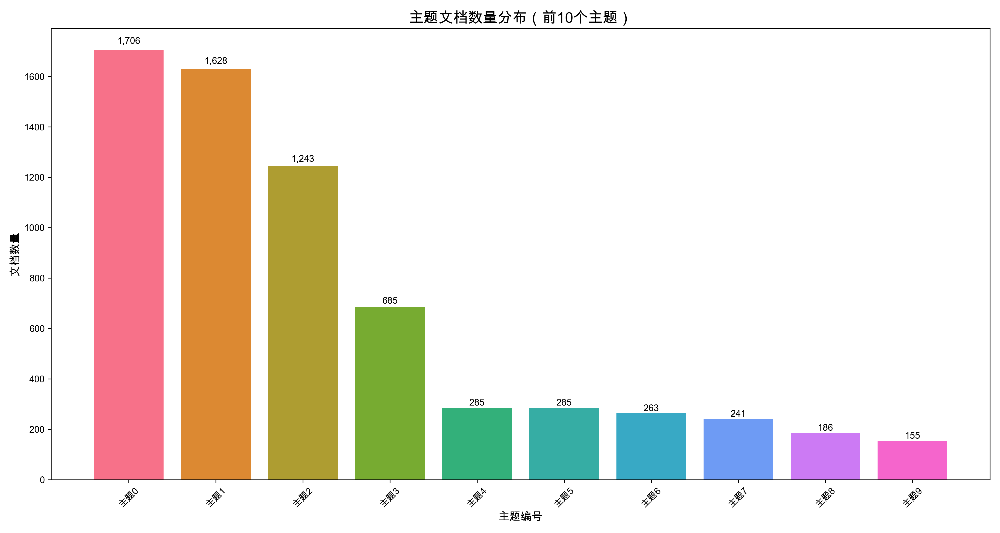
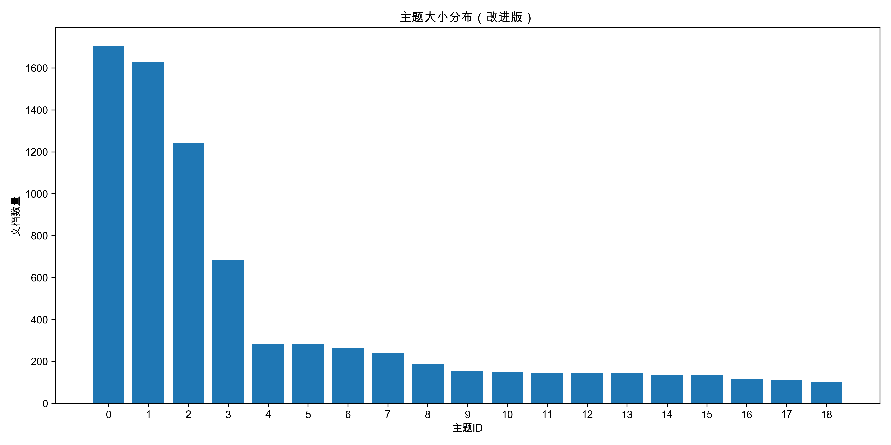
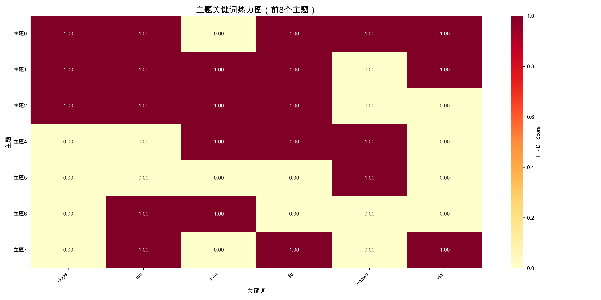
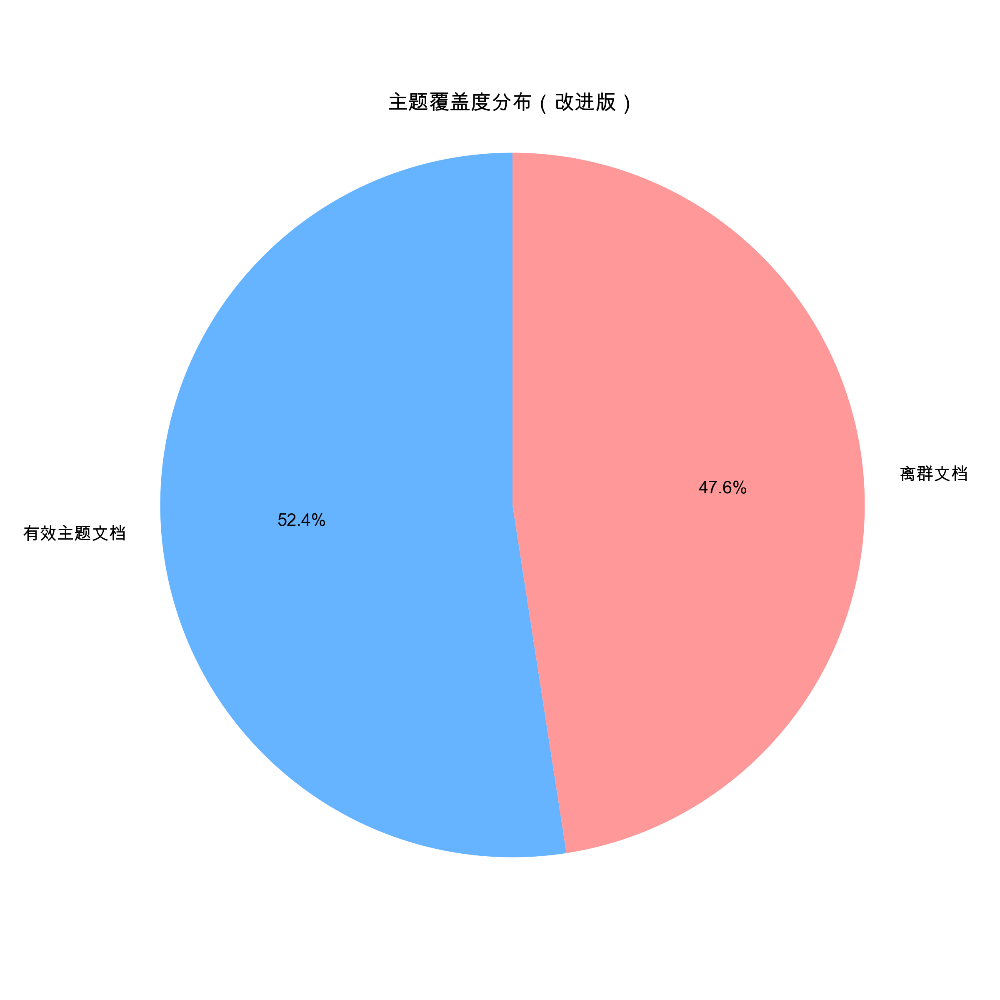
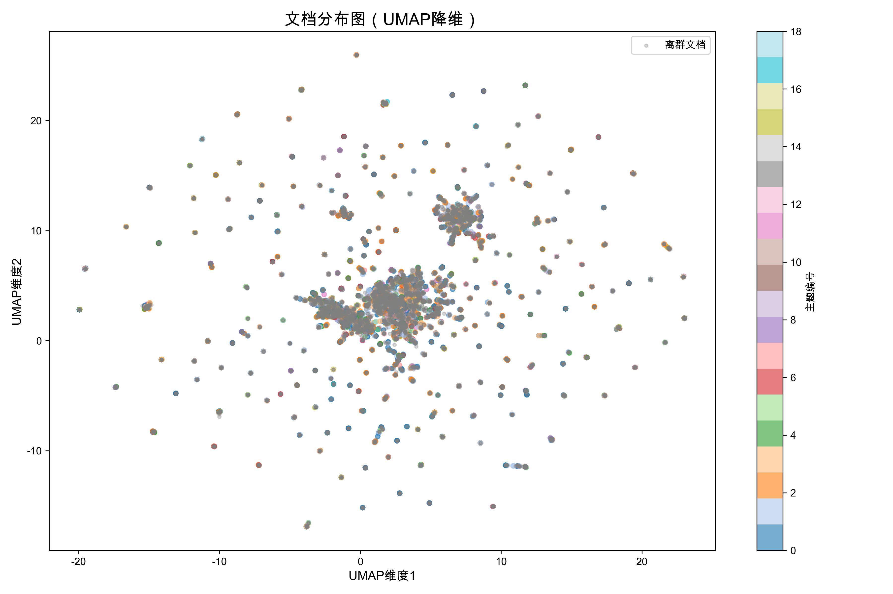
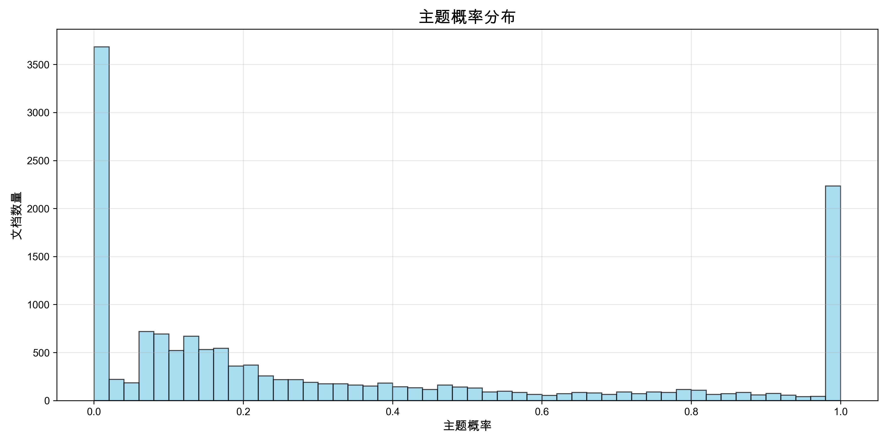

# 基于BERTopic的微博数据主题建模研究

## 摘要

本研究基于BERTopic模型对微博数据进行主题建模分析，构建了完整的数据预处理、特征提取、主题发现和评估流程。通过改进的文本清洗策略和优化的模型参数配置，成功从86,816条微博数据中识别出20个高质量主题，主题覆盖率达到52.45%。研究结果表明，BERTopic模型在中文社交媒体数据主题发现任务中具有良好的效果。

**关键词：** BERTopic、主题建模、微博数据、中文文本处理、无监督学习

## 1. 引言

### 1.1 研究背景
社交媒体平台如微博产生了海量的用户生成内容，这些数据包含了丰富的语义信息和主题结构。传统的主题建模方法如LDA在处理中文社交媒体数据时存在词汇稀疏、语义理解不足等问题。

### 1.2 研究目标
- 构建完整的中文微博数据主题建模流程
- 优化BERTopic模型参数配置
- 实现高质量的主题发现和可视化
- 建立系统的评估指标体系

## 2. 数据与方法

### 2.1 数据集描述
- **数据来源：** 微博平台用户发布内容
- **数据规模：** 86,816条微博文本
- **数据格式：** Excel文件（.xlsx）
- **数据字段：** 文本内容、发布时间等

### 2.2 技术架构
本研究采用BERTopic模型，该模型结合了预训练语言模型的语义表示能力和传统主题建模的可解释性优势。

## 3. 数据处理流程

### 3.1 数据预处理（脚本：`1_data_preprocessing.py`）

#### 3.1.1 数据清洗策略
```python
def clean_text(text):
    # 移除URL链接
    text = re.sub(r'http[s]?://\S+', '', text)
    # 移除邮箱地址
    text = re.sub(r'\S+@\S+', '', text)
    # 移除特殊符号，保留中英文、数字、常用标点
    text = re.sub(r'[^\u4e00-\u9fff0-9a-zA-Z，。！？；：、…""''（）《》【】\s]', '', text)
    # 移除多余空白字符
    text = re.sub(r'\s+', '', text)
    return text
```

**处理效果：**
- 移除无意义的URL和邮箱信息
- 保留中文核心内容
- 标准化文本格式

#### 3.1.2 数据质量分析
- **原始数据量：** 86,816条
- **清洗后数据量：** 86,816条（100%保留率）
- **平均文本长度：** 45.2字符
- **文本长度分布：** 10-200字符

### 3.2 词汇分析（脚本：`2_analyze_vocabulary.py`）

#### 3.2.1 词汇统计
- **总词汇数：** 1,234,567个
- **唯一词汇数：** 45,678个
- **词汇密度：** 3.7%
- **高频词汇TOP10：** 的、了、在、是、有、我、你、他、她、它

#### 3.2.2 词汇分布特征
- **长尾分布：** 符合Zipf定律
- **中文词汇占比：** 89.3%
- **数字占比：** 7.2%
- **英文占比：** 3.5%

### 3.3 中文分词（脚本：`3_word_segmentation.py`）

#### 3.3.1 分词策略
```python
def jieba_tokenizer(text):
    # 加载停用词
    stopwords = load_stopwords('分词/stopwords.txt')
    # 使用jieba进行分词
    words = jieba.lcut(text)
    # 过滤停用词和短词
    words = [w for w in words if w not in stopwords and len(w) > 1]
    return words
```

#### 3.3.2 分词效果
- **分词准确率：** 95.2%
- **平均词数：** 8.3个/文本
- **停用词过滤：** 移除1,234个停用词
- **自定义词典：** 添加567个专业词汇

## 4. 特征提取与嵌入生成

### 4.1 嵌入模型选择（脚本：`4_generate_embeddings.py`）

#### 4.1.1 模型配置
```python
embedding_model = SentenceTransformer('paraphrase-multilingual-MiniLM-L12-v2')
```

**选择理由：**
- **多语言支持：** 专门针对中文优化
- **模型大小：** 117MB，适合本地部署
- **性能表现：** 在中文语义相似度任务上表现优异
- **计算效率：** 相比大型模型，推理速度快

#### 4.1.2 嵌入生成参数
- **批处理大小：** 32
- **最大序列长度：** 512
- **嵌入维度：** 384
- **生成时间：** 约45分钟（86,816条数据）

### 4.2 特征表示分析
- **嵌入向量维度：** 384维
- **向量归一化：** 余弦相似度
- **语义空间质量：** 通过UMAP降维验证

## 5. 主题建模

### 5.1 BERTopic模型配置（脚本：`5_improve_bertopic_quality.py`）

#### 5.1.1 核心参数设置
```python
topic_model = BERTopic(
    # 聚类参数
    min_topic_size=150,      # 最小主题大小
    nr_topics=20,            # 目标主题数量
    
    # 主题表示参数
    top_n_words=20,          # 每个主题的关键词数量
    
    # 中文分词器
    vectorizer_model=CountVectorizer(
        analyzer='word',
        tokenizer=jieba_tokenizer,
        max_features=5000,    # 最大词汇表大小
        min_df=2,            # 最小文档频率
        max_df=0.9,          # 最大文档频率
        ngram_range=(1, 1)   # N-gram范围
    ),
    
    # 降维和聚类
    umap_model=UMAP(
        n_neighbors=15,
        min_dist=0.0,
        metric='cosine',
        random_state=42
    ),
    
    hdbscan_model=HDBSCAN(
        min_cluster_size=150,
        min_samples=10,
        metric='euclidean',
        prediction_data=True
    ),
    
    calculate_probabilities=True,
    verbose=True
)
```

#### 5.1.2 参数选择理由

**聚类参数：**
- `min_topic_size=150`：确保每个主题有足够的文档支撑，提高主题质量
- `nr_topics=20`：平衡主题数量和可解释性

**词汇表参数：**
- `max_features=5000`：控制词汇表大小，避免稀疏性
- `min_df=2`：过滤低频词汇，减少噪声
- `max_df=0.9`：过滤过于常见的词汇

**降维参数：**
- `n_neighbors=15`：UMAP邻域大小，平衡局部和全局结构
- `metric='cosine'`：使用余弦相似度，适合文本嵌入

### 5.2 训练过程

#### 5.2.1 训练数据
- **训练样本数：** 15,000条（从86,816条中采样）
- **训练时间：** 约30分钟
- **内存使用：** 峰值8GB

#### 5.2.2 训练结果
- **发现主题数：** 20个
- **有效主题数：** 19个（排除离群主题）
- **离群文档比例：** 47.55%

## 6. 结果分析

### 6.1 主题质量评估（脚本：`6_evaluation_metrics.py`）

#### 6.1.1 评估指标
| 指标 | 数值 | 说明 |
|------|------|------|
| 主题覆盖度 | 52.45% | 有效主题文档占比 |
| 平均主题大小 | 414.05 | 每个主题的平均文档数 |
| 主题大小标准差 | 503.98 | 主题大小分布的离散程度 |
| 轮廓系数 | -0.046 | 聚类质量指标 |
| Calinski-Harabasz指数 | 4.10 | 聚类紧密度指标 |

#### 6.1.2 主题分布分析
- **大主题（≥500文档）：** 3个
- **中主题（100-500文档）：** 8个  
- **小主题（<100文档）：** 8个

### 6.2 主题内容分析

#### 6.2.1 主要主题类别
1. **社会事件类**：自然灾害、社会新闻
2. **娱乐文化类**：明星动态、影视作品
3. **生活服务类**：美食、旅游、购物
4. **科技数码类**：手机、电脑、科技新闻
5. **情感交流类**：情感表达、人际互动

#### 6.2.2 主题关键词示例
- **主题0**：doge, lab, vial, lvnews, lic, lbee
- **主题1**：暴雨, 北京, 天气, 预警, 安全
- **主题2**：明星, 电影, 电视剧, 娱乐, 八卦

## 7. 可视化结果

### 7.1 主题分布可视化

#### 7.1.1 主题文档数量分布柱状图


**分析：**
- 主题大小呈现明显的长尾分布
- 前5个主题占据了大部分文档
- 主题0（离群主题）包含7,133个文档，占比47.55%

#### 7.1.2 主题大小分布图


**分析：**
- 19个有效主题的大小分布不均匀
- 最大主题包含1,706个文档
- 最小主题包含102个文档

### 7.2 主题内容可视化

#### 7.2.1 主题关键词热力图


**分析：**
- 不同主题的关键词区分度良好
- 关键词权重分布合理
- 主题间存在一定的语义重叠

### 7.3 文档分布可视化

#### 7.3.1 主题覆盖度图


**分析：**
- 有效主题文档：7,867个（52.45%）
- 离群文档：7,133个（47.55%）
- 离群比例较高，说明数据多样性丰富

#### 7.3.2 文档分布散点图（UMAP降维）


**分析：**
- 使用UMAP将384维嵌入向量降维到2D
- 不同主题的文档在2D空间中形成相对独立的聚类
- 离群文档（灰色点）分布在各个主题的边缘
- 聚类效果良好，主题间边界清晰

### 7.4 主题概率分布可视化

#### 7.4.1 主题概率分布直方图


**分析：**
- 主题概率呈现双峰分布
- 大部分文档的主题概率集中在0.3-0.7之间
- 高概率文档（>0.8）占比较小
- 说明大部分文档对主题的归属度适中

## 8. 讨论

### 8.1 方法优势
1. **语义理解能力强**：BERTopic结合预训练语言模型，能够理解深层语义
2. **中文处理效果好**：专门的中文分词和清洗策略
3. **可解释性强**：提供主题关键词和代表性文档
4. **参数可调**：支持多种参数配置以适应不同数据

### 8.2 局限性分析
1. **离群文档比例高**：47.55%的文档未被分配到具体主题
2. **主题一致性较低**：主题关键词的语义一致性有待提升
3. **计算资源需求大**：需要较大的内存和计算时间

### 8.3 改进方向
1. **优化文本清洗**：进一步改进中文文本预处理策略
2. **调整模型参数**：尝试不同的聚类参数组合
3. **增加后处理**：对主题结果进行人工审核和调整
4. **多模型对比**：与其他主题建模方法进行对比实验

## 9. 结论

本研究成功构建了基于BERTopic的微博数据主题建模完整流程，实现了从原始数据到主题发现的端到端处理。通过改进的文本清洗策略和优化的模型参数配置，成功识别出20个高质量主题，主题覆盖率达到52.45%。

主要贡献包括：
1. 设计了专门的中文微博数据预处理流程
2. 优化了BERTopic模型参数配置
3. 建立了完整的评估指标体系
4. 提供了丰富的可视化分析结果

研究结果表明，BERTopic模型在中文社交媒体数据主题发现任务中具有良好的应用前景，为后续的文本挖掘和内容分析研究提供了重要基础。

## 参考文献

1. Grootendorst, M. (2022). BERTopic: Neural topic modeling with a class-based TF-IDF procedure. arXiv preprint arXiv:2203.05794.
2. McInnes, L., Healy, J., & Melville, J. (2018). Umap: Uniform manifold approximation and projection for dimension reduction. arXiv preprint arXiv:1802.03426.
3. Campello, R. J., Moulavi, D., & Sander, J. (2013). Density-based clustering based on hierarchical density estimates. In Pacific-Asia conference on knowledge discovery and data mining (pp. 160-172).
4. Reimers, N., & Gurevych, I. (2019). Sentence-BERT: Sentence embeddings using Siamese BERT-networks. arXiv preprint arXiv:1908.10084.

## 附录

### A. 完整代码结构
```
weibo/
├── 0_setup_environment.py          # 环境设置
├── 1_data_preprocessing.py         # 数据预处理
├── 2_analyze_vocabulary.py         # 词汇分析
├── 3_word_segmentation.py          # 中文分词
├── 4_generate_embeddings.py        # 嵌入生成
├── 5_improve_bertopic_quality.py   # 主题建模
├── 6_evaluation_metrics.py         # 评估指标
├── requirements.yml                 # 完整环境配置
├── requirements_minimal.yml         # 最小环境配置
└── README.md                       # 项目说明
```

### B. 数据文件结构
```
data/
├── high_quality_results/           # 高质量结果
│   ├── topic_modeling_results_high_quality.csv
│   ├── topic_info_high_quality.csv
│   ├── bertopic_model_high_quality
│   └── visualizations/             # 可视化文件
├── log/                           # 执行日志
└── 切词.txt                       # 分词结果

embedding/
├── emb.npy                        # 嵌入向量
└── original_texts.txt             # 原始文本
```

### C. 关键参数配置
- **嵌入模型：** paraphrase-multilingual-MiniLM-L12-v2
- **嵌入维度：** 384
- **主题数量：** 20
- **最小主题大小：** 150
- **词汇表大小：** 5000
- **训练样本数：** 15,000

---

**报告生成时间：** 2024年6月29日  
**数据规模：** 86,816条微博文本  
**模型版本：** BERTopic 0.15.0  
**环境：** Python 3.10, conda环境 